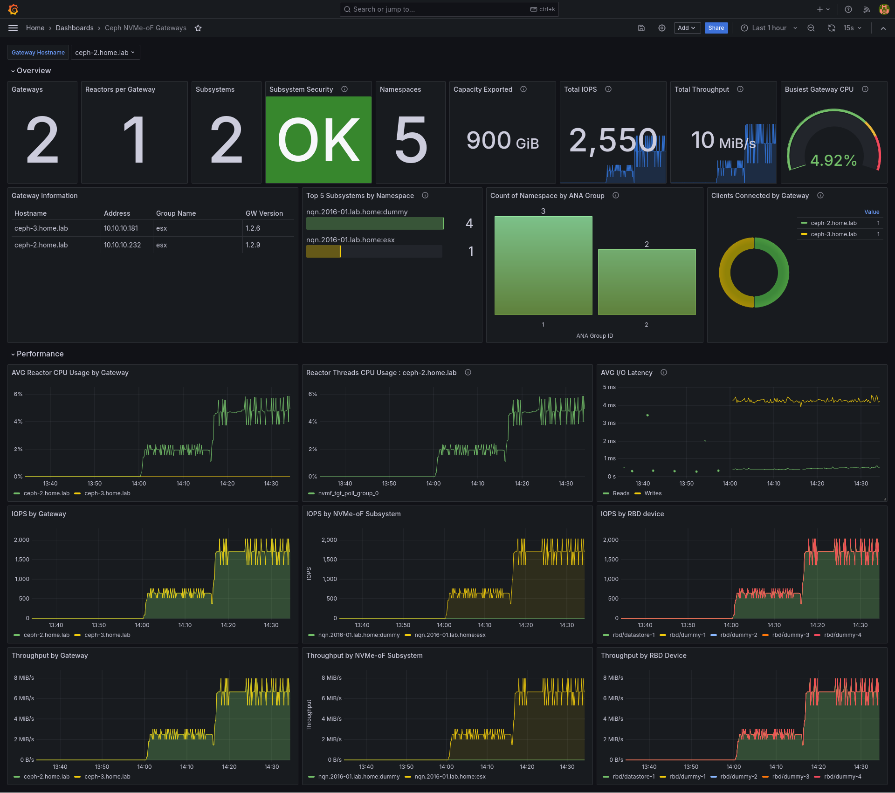

[](https://github.com/ceph/ceph-nvmeof/actions/workflows/build-container.yml)
# Ceph NVMe over Fabrics (NVMe-oF) Gateway

This project provides block storage on top of Ceph for platforms (e.g.: VMWare) without
native Ceph support (RBD), replacing existing approaches (iSCSI) with a newer and [more
versatile standard (NVMe-oF)](https://nvmexpress.org/specification/nvme-of-specification/).

Essentially, it allows to export existing RBD images as NVMe-oF namespaces.
The [creation and management of RBD images](https://docs.ceph.com/en/latest/rbd/) is not within the scope of this component.

## Installation

### Requirements

* Linux-based system with at least 16 GB of available RAM. [Fedora 37](https://fedoraproject.org/) is recommended.
* SELinux in permissive mode:

  ```bash
  sed -i s/^SELINUX=.*$/SELINUX=permissive/ /etc/selinux/config
  setenforce 0
  ```

### Dependencies

* `moby-engine` (`docker-engine`) (v20.10) and `docker-compose` (v1.29). These versions are just indicative
*  `make` (only needed to launch `docker-compose` commands).

To install these dependencies in Fedora:

```bash
sudo dnf install -y make moby-engine docker-compose
```

Some [post-installation steps](https://docs.docker.com/engine/install/linux-postinstall/) are required to use `docker` with regular users:

```bash
sudo groupadd docker
sudo usermod -aG docker $USER
```

### Steps

To launch a containerized environment with a Ceph cluster and a NVMe-oF gateway (this is not the [prescribed deployment for production purposes](https://docs.ceph.com/en/quincy/install/#recommended-methods), but for testing and development tasks alone):

1. Get this repo:

    ```bash
    git clone https://github.com/ceph/ceph-nvmeof.git
    cd ceph-nvmeof
    git submodule update --init --recursive
    ```

1. Configure the environment (basically to allocate huge-pages, which requires entering the user password):

    ```bash
    make setup
    ```

1. Download the container images:

    ```bash
    make pull
    ```

1. Deploy the containers locally:

    ```bash
    make up
    ```

1. Check that the deployment is up and running:

    ```bash
    $ make ps

        Name                    Command                  State                               Ports
    -----------------------------------------------------------------------------------------------------------------------
    ceph              sh -c ./vstart.sh --new $V ...   Up (healthy)   5000/tcp, 6789/tcp, 6800/tcp, 6801/tcp, 6802/tcp,
                                                                      6803/tcp, 6804/tcp, 6805/tcp, 80/tcp
    nvmeof_nvmeof_1   python3 -m control -c ceph ...   Up             0.0.0.0:4420->4420/tcp,:::4420->4420/tcp,
                                                                      0.0.0.0:5500->5500/tcp,:::5500->5500/tcp,
                                                                      0.0.0.0:8009->8009/tcp,:::8009->8009/tcp
    ```

1. The environment is ready to provide block storage on Ceph via NVMe-oF.

## Usage Demo

### Configuring the NVMe-oF Gateway

The following command executes all the steps required to set up the NVMe-oF environment:

```bash
$ make demo
docker-compose  exec  ceph bash -c "rbd -p rbd info demo_image || rbd -p rbd create demo_image --size 10M"
rbd: error opening image demo_image: (2) No such file or directory
docker-compose  run --rm nvmeof-cli --server-address 192.168.13.3 --server-port 5500 subsystem add --subsystem "nqn.2016-06.io.spdk:cnode1"
Adding subsystem nqn.2016-06.io.spdk:cnode1: Successful
docker-compose  run --rm nvmeof-cli --server-address 192.168.13.3 --server-port 5500 namespace add --subsystem "nqn.2016-06.io.spdk:cnode1" --rbd-pool rbd --rbd-image demo_image
Adding namespace 1 to nqn.2016-06.io.spdk:cnode1: Successful
docker-compose  run --rm nvmeof-cli --server-address 192.168.13.3 --server-port 5500 listener add --subsystem "nqn.2016-06.io.spdk:cnode1" --host-name fbca1a3d3ed8 --traddr 192.168.13.3 --trsvcid 4420
Adding listener 192.168.13.3:4420 to nqn.2016-06.io.spdk:cnode1: Successful
docker-compose  run --rm nvmeof-cli --server-address 2001:db8::3 --server-port 5500 listener add --subsystem "nqn.2016-06.io.spdk:cnode1" --host-name fbca1a3d3ed8 --traddr 2001:db8::3 --trsvcid 4420 --adrfam IPV6
Adding listener [2001:db8::3]:4420 to nqn.2016-06.io.spdk:cnode1: Successful
docker-compose  run --rm nvmeof-cli --server-address 192.168.13.3 --server-port 5500 host add --subsystem "nqn.2016-06.io.spdk:cnode1" --host "*"
Allowing any host for nqn.2016-06.io.spdk:cnode1: Successful
```

#### Manual Steps

The same configuration can also be manually run:

1. First of all, let's create the `cephnvmf` shortcut to interact with the NVMe-oF gateway:

    ```bash
    eval $(make alias)
    ```

1.  In order to start working with the NVMe-oF gateway, we need to create an RBD image first (`demo_image` in the `rbd` pool):

    ```bash
    make rbd
    ```

1. Create a subsystem:

    ```bash
    cephnvmf subsystem add --subsystem nqn.2016-06.io.spdk:cnode1
    ```

1. Add a namespace:

    ```bash
    cephnvmf namespace add --subsystem nqn.2016-06.io.spdk:cnode1 --rbd-pool rbd --rbd-image demo_image
    ```

1. Create a listener so that NVMe initiators can connect to:

    ```bash
    cephnvmf listener add ---subsystem nqn.2016-06.io.spdk:cnode1 --host-name host_name -a gateway_addr -s 4420
    ```

1. Define which hosts can connect:

    ```bash
    cephnvmf host add --subsystem nqn.2016-06.io.spdk:cnode1 --host "*"
    ```


### Mounting the NVMe-oF volume

Once the NVMe-oF target is

1. Install requisite packages:

    ```bash
    sudo dnf install nvme-cli
    sudo modprobe nvme-fabrics
    ```

1. Ensure that the listener is reachable from the NVMe-oF initiator:

    ```bash
    $ sudo nvme discover -t tcp -a 192.168.13.3 -s 4420

    Discovery Log Number of Records 1, Generation counter 2
    =====Discovery Log Entry 0======
    trtype:  tcp
    adrfam:  ipv4
    subtype: nvme subsystem
    treq:    not required
    portid:  0
    trsvcid: 4420
    subnqn:  nqn.2016-06.io.spdk:cnode1
    traddr:  192.168.13.3
    eflags:  not specified
    sectype: none
    ```

1. Connect to desired subsystem:

    ```bash
    sudo nvme connect -t tcp --traddr 192.168.13.3 -s 4420 -n nqn.2016-06.io.spdk:cnode1
    ```

1. List the available NVMe targets:

    ```bash
    $ sudo nvme list
    Node                  Generic               SN                   Model                                    Namespace Usage                      Format           FW Rev
    --------------------- --------------------- -------------------- ---------------------------------------- --------- -------------------------- ---------------- --------
    /dev/nvme1n1          /dev/ng1n1            Ceph00000000000001   Ceph bdev Controller                     1          10,49  MB /  10,49  MB      4 KiB +  0 B   23.01
    ...
    ```

1. Create a filesystem on the desired target:

    ```bash
    $  sudo mkfs /dev/nvme1n1
    mke2fs 1.46.5 (30-Dec-2021)
    Discarding device blocks: done
    Creating filesystem with 2560 4k blocks and 2560 inodes

    Allocating group tables: done
    Writing inode tables: done
    Writing superblocks and filesystem accounting information: done
    ```

1. Mount and use the storage volume

    ```bash
    $ mkdir /mnt/nvmeof
    $ sudo mount /dev/nvme1n1 /mnt/nvmeof

    $ ls /mnt/nvmeof
    lost+found

    $ sudo bash -c "echo Hello NVMe-oF > /mnt/nvmeof/hello.txt"

    $ cat /mnt/nvmeof/hello.txt
    Hello NVMe-oF
    ```

### Start Discovery Service(Optional)

The discovery service can provide all the targets that the current user can access, and these target information is sourced from ceph omap. These targets may be running or just a record.

1. Start Discovery Service
    ```bash
    $ python3 -m control.discovery
    ```

2. To start discovery service container in docker-compose environment
   ```bash
   $ docker-compose up --detach discovery
   ```

3. Discover targets from discovery service. The default port is 8009.
   ```bash
   $ nvme discover -t tcp -a 192.168.13.3 -s 8009
   ```

## Advanced

### Configuration

This service comes with a pre-defined configuration that matches the most common use cases. For advanced configuration, please update the settings at the `.env` file. That file is automatically read by `docker-compose`. However, it's a perfectly valid bash source, so that it can also be used as:

```bash
source .env
echo $NVMEOF_VERSION...
```

### mTLS Configuration for testing purposes

For testing purposes, self signed certificates and keys can be generated locally using OpenSSL.

For the server, generate credentials for the server named 'my.server' and save them in files called server.key and server.crt. Additionally, specify subject alternative names using the gateway group nodes' IPs in the openssl command.

```bash
$ openssl req -x509 -newkey rsa:4096 -nodes -keyout server.key -out server.crt -days 3650 -subj '/CN=my.server' -addext "subjectAltName=IP:192.168.13.3,IP:192.168.13.4,IP:192.168.13.5,IP:192.168.13.6"
```

For client:

```bash
$ openssl req -x509 -newkey rsa:4096 -nodes -keyout client.key -out client.crt -days 3650 -subj '/CN=client1'
```

Indicate the location of the keys and certificates in the config file:

```ini
[mtls]

server_key = ./server.key
client_key = ./client.key
server_cert = ./server.crt
client_cert = ./client.crt
```

### Huge-Pages

[DPDK requires hugepages](https://doc.dpdk.org/guides/linux_gsg/sys_reqs.html#linux-gsg-hugepages) to be set up:

```bash
sh -c 'echo 4096 > /sys/kernel/mm/hugepages/hugepages-2048kB/nr_hugepages'
```

This is automatically done in the `make setup` step. The amount of hugepages can be configured with `make setup HUGEPAGES=512`.

## Development

### Set-up
The development environment relies on containers (specifically `docker-compose`) for building and running the components. This has the benefit that, besides `docker` and `docker-compose`, no more dependencies need to be installed in the host environment.

Once the GitHub repo has been cloned, remember to initialize its git submodules (`spdk`, which in turn depends on other submodules):

```bash
git submodule update --init --recursive
```

For building, SELinux might cause issues, so it's better to set it to permissive mode:

```bash
# Change it for the running session
sudo setenforce 0

# Persist the change across boots
sudo sed -i -E 's/^SELINUX=enforcing$/SELINUX=permissive/' /etc/selinux/config
```

### Building

#### Containers

To avoid having to deal with `docker-compose` commands, this provides a `Makefile` that wraps those as regular `make` targets:

To build the container images from the local sources:

```bash
make build
```

The resulting images should be like these:

```bash
$ docker images
REPOSITORY                    TAG       IMAGE ID       CREATED         SIZE
quay.io/ceph/nvmeof-cli       0.0.1     8277cd0cce2d   7 minutes ago   995MB
quay.io/ceph/nvmeof           0.0.1     34d7230dcce8   7 minutes ago   439MB
quay.io/ceph/vstart-cluster   17.2.6    cb2560975055   8 minutes ago   1.27GB
quay.io/ceph/spdk             23.01     929e22e22ffd   8 minutes ago   342MB
```

* `spdk` is an intermediate image that contains an RPM-based installation of spdk with `rbd` support enabled.
* `nvmeof` is built from the `spdk` container by installing the Python package.
* `nvmeof-cli` provides a containerized environment to run CLI commands that manage the `nvmeof` service via gRPC.
* `ceph` is a sandboxed (vstart-based) Ceph cluster for testing purposes.

For building a specific service:

```bash
make build SVC=nvmeof
```

#### Stand-alone Packages

To generate independent RPM and Python wheel packages:

```bash
make export-rpms export-python
RPMs exported to:
/tmp/rpm/x86_64/spdk-libs-23.01-0.x86_64.rpm
/tmp/rpm/x86_64/spdk-devel-23.01-0.x86_64.rpm
/tmp/rpm/x86_64/spdk-23.01-0.x86_64.rpm
Python wheel exported to:
/tmp/ceph_nvmeof-0.0.1-py3-none-any.whl
```

To install nvmeof-cli as a CLI tool from the above Python wheel package, (or alternatively only build the cli package):
```
make export-python
pip install /tmp/ceph_nvmeof-0.0.1-py3-none-any.whl
ceph-nvmeof // use nvmeof-cli tool!
```

This can also be installed from https://pypi.org/project/ceph-nvmeof/, by running `pip3 install ceph-nvmeof`.

### Development containers

To avoid having to re-build container on every code change, developer friendly containers are provided:

```bash
docker-compose up nvmeof-devel
```

Devel containers provide the same base layer as the production containers but with the source code mounted at run-time.

### Adding, removing or updating Python dependencies

Python dependencies are specified in the file `pyproject.toml`
([PEP-621](https://peps.python.org/pep-0621/)), specifically under the `dependencies` list.

After modifying it, the dependency lockfile (`pdm.lock`) needs to be updated accordingly (otherwise container image builds will fail):

```bash
make update-lockfile
git add pdm.lock
```

## Help

To obtain a detailed list of `make` targets, run `make help`:

```
Makefile to build and deploy the Ceph NVMe-oF Gateway

Usage:
    make [target] [target] ... OPTION=value ...

Targets:

  Basic targets:
      clean           Clean-up environment
      export-python   Build Ceph NVMe-oF Gateway Python package and copy it to /tmp
      export-rpms     Build SPDK RPMs and copy them to $(EXPORT_DIR)/rpm
      setup           Configure huge-pages (requires sudo/root password)
      up              Services
      update-lockfile Update dependencies in lockfile (pdm.lock)

    Options:
      EXPORT_DIR      Directory to export packages (RPM and Python wheel) (Default: /tmp)
      up: SVC         Services (Default: nvmeof)

  Deployment commands (docker-compose):
      build           Build SVC images
      down            Shut down deployment
      events          Receive real-time events from containers
      exec            Run command inside an existing container
      images          List images
      logs            View SVC logs
      pause           Pause running deployment
      port            Print public port for a port binding
      ps              Display status of SVC containers
      pull            Download SVC images
      push            Push nvmeof and nvmeof-cli containers images to quay.io registries
      restart         Restart SVC
      run             Run command CMD inside SVC containers
      shell           Exec shell inside running SVC containers
      stop            Stop SVC
      top             Display running processes in SVC containers
      unpause         Resume paused deployment
      up              Launch services

    Options:
      CMD             Command to run with run/exec targets (Default: )
      DOCKER_COMPOSE  Docker-compose command (Default: docker-compose)
      OPTS            Docker-compose subcommand options (Default: )
      SCALE           Number of instances (Default: 1)
      SVC             Docker-compose services (Default: )

  Demo:
      demo            Expose RBD_IMAGE_NAME as NVMe-oF target

  Miscellaneous:
      alias           Print bash alias command for the nvmeof-cli. Usage: "eval $(make alias)"
```

Targets may accept options: `make run SVC=nvme OPTS=--entrypoint=bash`.

## Monitoring and Observability
Each gateway daemon implements a prometheus exporter endpoint, which can expose performance and relevant metadata over port 10008/tcp. The endpoint is enabled by default, but if you don't see port 10008 listening, check the `ceph-nvmeof.conf` file.
```
enable_prometheus_exporter = True
```

The image below shows a sample Grafana dashboard that provides a good starting point for monitoring the performance and configuration of an NVMe-oF gateway group.


The JSON for the dashboard can be found [here](monitoring/Ceph-NVMe-oF-Gateways-Dashboard.json), and can simply be imported into your Grafana instance. *Note: Although Grafana v11 was used to develop the dashboard, it should work in v10.x as well.*
  

## Troubleshooting

## Contributing and Support

See [`CONTRIBUTING.md`](CONTRIBUTING.md).

## Code of Conduct

See [Ceph's Code of Conduct](https://ceph.io/en/code-of-conduct/).

## License

See [`LICENSE`](LICENSE).
